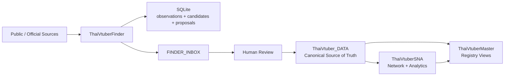

# ThaiVtuberFinder

**ค้นหา → normalize → dedupe → enrich → ส่งให้คนตรวจ ก่อนเข้า canonical**

ThaiVtuberFinder คือ discovery/enrichment worker ของระบบ Thai VTuber data stack เขียนด้วย Go + native SQLite + Docker และรันแบบ 24/7 ได้บน Railway

Finder **ไม่ใช่ canonical database และไม่ auto-promote persona** หน้าที่คือค้นหาบัญชีสาธารณะ เก็บ stable platform identity/provenance สร้าง candidate และ relation proposal แล้วส่งเข้า `ThaiVtuber_DATA / FINDER_INBOX` เพื่อ human review

## System architecture



> **Finder discovers. Humans review. ThaiVtuber_DATA decides. SNA analyzes. Master presents.**

| Component | Responsibility |
|---|---|
| **ThaiVtuberFinder** | Discovery, normalization, stable-ID resolution, dedupe, provenance, cross-platform enrichment, review candidates |
| **ThaiVtuber_DATA** | Canonical personas, accounts, account links, organizations, affiliations, lifecycle state, reviewed decisions |
| [ThaiVtuberSNA](https://github.com/Icezaza2543/ThaiVtuberSNA) | Downstream audience/network analytics and derived exports |
| [ThaiVtuberMaster](https://github.com/Icezaza2543/ThaiVtuberMaster) | Public-facing registry and analytics explorer |

## Data rules

- `ThaiVtuber_DATA` is the canonical source of truth.
- Finder writes discovery candidates to `FINDER_INBOX`; it does not directly create canonical `PERSONAS`, `ACCOUNTS`, or `ACCOUNT_LINKS`.
- Human review is required before canonical promotion.
- Stable platform ID wins over mutable handle/display name.
- A new persona/model/re-debut remains a separate persona until explicitly reviewed.
- Similar names, voices, artwork, handles, or presumed shared operators never justify automatic persona merging.
- Organization/group accounts stay separate from individual personas.
- Source membership is a discovery signal, not automatic verification.
- Existing curator fields in `FINDER_INBOX` are preserved during machine sync.
- `source_url`/provenance must remain traceable.

## Discovery and enrichment

Current adapters support bounded, explicit public sources such as:

| Source type | Behavior |
|---|---|
| Kerlos/Chuysan | Reads the public Thai VTuber directory feed and resolves stable YouTube channel IDs |
| VtuberThaiInfo archive | Reads the talent list embedded in the archived VtuberThaiInfo directory; YouTube by stable channel ID, Twitch by normalized URL |
| Bluesky | Starter packs/lists via public AT Protocol APIs; DID is used as stable identity |
| Official rosters | Explicit agency/project/event links or structured payloads |
| HTML roster | Extracts supported account links from explicitly configured static pages |
| JSON/JSONL/CSV | Imports curated lead/export files |
| YouTube | Resolves explicit channel/handle/video/Shorts/live URLs; broad search remains opt-in and quota-bounded |

Cross-platform enrichment records explicit profile/bio evidence and can create
`pending_review` relation proposals. It does **not** auto-link those accounts to a
canonical persona.

## Canonical comparison

Before appending a candidate, Finder compares normalized identities against:

1. SQLite candidate/observation state
2. existing `FINDER_INBOX`
3. canonical `ACCOUNTS` / `ACCOUNT_LINKS`

Known identities are updated/deduplicated rather than appended again.

## Google Sheet sync

`FINDER_INBOX` machine-managed columns are updated without overwriting human review fields.

Human review fields remain curator-owned. Typical review actions are:

- `create_persona`
- `link_persona`
- `account_only`
- `ignore`

Organization/group accounts should normally use `account_only`, not a persona link.

## Docker quick start

```bash
git clone https://github.com/Icezaza2543/ThaiVtuberFinder.git
cd ThaiVtuberFinder
cp .env.example .env
mkdir -p secrets
docker compose up -d --build
docker compose logs -f --tail=50 finder
```

Windows PowerShell:

```powershell
Copy-Item .env.example .env
New-Item -ItemType Directory -Force secrets
```

### Google Sheets

Enable Google Sheets API, give the service account Editor access to **ThaiVtuber_DATA**,
then configure:

```dotenv
SHEETS_SYNC=true
GOOGLE_SHEET_ID=your_workbook_id
GOOGLE_APPLICATION_CREDENTIALS=secrets/google-service-account.json
YOUTUBE_API_KEY=
```

`GOOGLE_SERVICE_ACCOUNT_JSON` is also supported for hosted environments such as Railway.
Never commit credentials.

## Runtime

The worker uses SQLite/WAL and persistent disk. Production should use:

- one replica
- one writer per workbook
- persistent `/app/data`
- `/healthz` for liveness
- `/readyz` for first-cycle readiness

Do not place SQLite on shared network storage.

## Local commands

```bash
make check
./bin/finder demo
./bin/finder once
./bin/finder worker
./bin/finder status
./bin/finder doctor
```

Export reviewed handoff proposals:

```bash
finder export -config /app/config/finder.json > handoff.json
```

The handoff is a proposal/review artifact. Downstream consumers must validate it before
canonical application.

## Tests

```bash
go test -race -count=1 ./...
go vet ./...
```

Tests cover normalization/dedupe, repeated sync, curator-column preservation, quota
persistence, resolver behavior, Google JWT signing, proposal validation, and production
regressions such as duplicate URL normalization.

## Repository responsibility boundary

ThaiVtuberFinder should keep getting better at **finding and explaining candidates**.
It should not absorb canonical identity decisions, SNA computation, or public UI concerns.

Related projects:

- **ThaiVtuber_DATA** — canonical source of truth
- [ThaiVtuberSNA](https://github.com/Icezaza2543/ThaiVtuberSNA) — downstream network/analytics
- [ThaiVtuberMaster](https://github.com/Icezaza2543/ThaiVtuberMaster) — public-facing explorer

## References

- [Kerlos data source definition](https://github.com/kerlos/thai-vtuber/blob/main/hooks/useVTuberData.ts)
- [YouTube Data API](https://developers.google.com/youtube/v3)
- [Bluesky public API](https://docs.bsky.app/docs/advanced-guides/api-directory)
- [Google Sheets API quotas](https://developers.google.com/workspace/sheets/api/limits)
- [SQLite C interface](https://www.sqlite.org/cintro.html)
