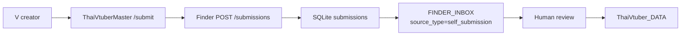

# Self-submission plan (ยังไม่ implement)

สถานะ: **แผน** — 2026-10-04. ยังไม่มีโค้ดส่วนนี้ใน repo.

## เป้าหมาย

ให้ VTuber และ V ประเภทอื่น (PNGTuber, VSinger, VArtist ฯลฯ) ส่งช่องของตัวเองเข้าระบบได้เอง
โดยยังรักษากฎเดิม: **Finder discovers. Humans review. ThaiVtuber_DATA decides.**

การส่งเองเป็น discovery signal เท่านั้น ไม่ใช่การยืนยัน และไม่เขียน canonical `PERSONAS` / `ACCOUNTS` / `ACCOUNT_LINKS` โดยตรง

## ตำแหน่งในสถาปัตยกรรม

- **Frontend:** หน้า `/submit` ใน `web/` ของ ThaiVtuberMaster (ธีมเดิม, ไทย/อังกฤษ)
- **API:** endpoint ใหม่ใน Finder (Railway) เพื่อใช้ `model.Normalize`, dedupe และ single workbook writer ตัวเดียวกัน
  - ต้องเปิด Finder เป็น public service (ปัจจุบัน unexposed) — เปิดเฉพาะ `/submissions` และ `/submissions/{token}`
  - ทางเลือก: Vercel Function ใน Master ที่ forward ไป Finder; ห้ามให้ Master เขียนชีตเอง
- **Staging:** ตาราง `submissions` ใน SQLite; รอบ sync ปกติเป็นผู้ส่งเข้า `FINDER_INBOX` (ไม่มีการเขียนชีตจาก request โดยตรง)

## Flow

1. **ฟอร์ม:** ชื่อ V, ประเภท (`vtuber|pngtuber|vsinger|vartist|other_v|organization`), ลิงก์ช่อง (หลายแพลตฟอร์ม), ค่าย (ถ้ามี), วันเดบิวต์, checkbox ยินยอมให้แสดงข้อมูลสาธารณะ
2. **ตรวจทันที:** normalize ลิงก์, แจ้งถ้ามีในทะเบียนแล้ว, resolve stable ID (YouTube `UC…`, Twitch user ID, Bluesky DID) เท่าที่ทำได้
3. **ยืนยันความเป็นเจ้าของ (optional):** ออกรหัส เช่น `TVF-7K2Q` ให้ใส่ใน bio/คำอธิบายช่องชั่วคราว แล้ว Finder ตรวจหน้า public
   - ผ่าน → `owner_verified_link`
   - ไม่ทำ → `self_submitted_unverified`
   - ทั้งสองแบบยังต้องผ่าน human review
4. **เข้า inbox:** `source_type=self_submission`, `source_url` inline (ลิงก์ช่องหรือหน้า submission) — ไม่มี EVIDENCE table
5. **Reviewer** ใช้ action เดิม: `create_persona` / `link_persona` / `account_only` / `ignore`
6. **ติดตามสถานะ:** ลิงก์ token แบบไม่ต้องสมัครสมาชิก

## กฎที่ต้องรักษา

- Persona ≠ account; ห้าม auto-link หลายบัญชีเป็นคนเดียวกันจากชื่อ/handle
- re-debut / โมเดลใหม่ เป็น persona แยก จนกว่าจะ review
- ไม่ invent stable ID; ถ้า resolve ไม่ได้ ให้ค้าง `unresolved_platform_id`
- ไม่เปลี่ยน unknown เป็น rejected/verified เพื่อหลบ error
- `FINDER_INBOX` L:S เป็นของ curator; sync แตะได้แค่ A:K และ T
- รับเฉพาะข้อมูลสาธารณะของครีเอเตอร์; ไม่เก็บอีเมล/ข้อมูลส่วนตัว; ไม่เก็บข้อมูลผู้ชม

## Anti-abuse

- Cloudflare Turnstile
- Rate limit ต่อ IP และต่อ normalized URL
- จำกัดจำนวนลิงก์ต่อ submission; allowlist โดเมนที่ `model.Normalize` รองรับ
- Payload size limit, parameterized statements เท่านั้น
- Submission จาก IP/URL เดิมซ้ำ ๆ → รวมเป็นแถวเดียว ไม่ append ซ้ำ

## Data model (ร่าง)

`submissions`

| column | หมายเหตุ |
|---|---|
| `id` | random token (ใช้ในลิงก์ติดตามสถานะ) |
| `created_at`, `updated_at` | UTC |
| `persona_name`, `v_type`, `agency`, `debut_date` | ข้อความที่ผู้ส่งกรอก |
| `accounts_json` | normalized accounts + resolved platform_id |
| `verify_code`, `verified_at`, `verified_account_key` | ownership check |
| `state` | `pending` → `queued_inbox` → `reviewed` |
| `ip_hash` | สำหรับ rate limit เท่านั้น, หมุน salt, ลบหลัง 30 วัน |

## Phases

| Phase | Scope | ขนาด |
|---|---|---|
| 1 | ฟอร์ม + `POST /submissions` + dedupe/known check + staging → inbox + Turnstile + rate limit | เล็ก–กลาง |
| 2 | Ownership code check + stable ID resolution อัตโนมัติ | กลาง |
| 3 | หน้าติดตามสถานะ + ขอแก้ข้อมูล/แจ้ง inactive (ผ่าน review) | กลาง |

## Acceptance (Phase 1)

- `go test -race ./...`, `go vet ./...`, `go build ./cmd/finder`, `go run ./cmd/finder demo` ผ่าน
- ส่ง URL ที่มีในทะเบียนแล้ว → ตอบว่ามีแล้ว, ไม่เกิดแถวใหม่
- ส่งซ้ำ → `duplicate_inbox_rows: 0` ใน `finder verify`
- ไม่มี secret/credential ใน repo; Turnstile secret อยู่ใน Railway variables

## คำถามที่ต้องตัดสินก่อนเริ่ม

1. เปิด Finder เป็น public หรือให้ Vercel Function เป็น proxy?
2. ต้องการ ownership check ตั้งแต่ Phase 1 ไหม?
3. ข้อความยินยอม/นโยบายความเป็นส่วนตัว ใช้ภาษาอะไร ใครเป็นผู้อนุมัติ?
